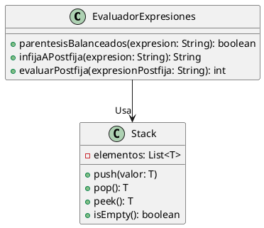

# 📊 Evaluador de Expresiones Aritméticas

Este proyecto es un **evaluador de expresiones aritméticas** en **Java**, que permite convertir expresiones en notación infija a postfija (notación polaca inversa) y evaluarlas mediante una **pila (Stack)**. Además, cuenta con una **interfaz gráfica** que facilita la interacción con el usuario.

---

## 🚀 **Características**
✔ **Verificación de paréntesis balanceados**  
✔ **Conversión de notación infija a postfija**  
✔ **Evaluación de expresiones postfijas**  
✔ **Uso de estructura de datos Pila (Stack) para conversión y evaluación**  
✔ **Interfaz gráfica amigable con botones para cada operación**  
✔ **Generación de UML con PlantUML en IntelliJ IDEA**  

---

## 📂 **Estructura del Proyecto**
```
EvaluadorExpresiones/
│── src/
│   ├── modelo/
│   │   ├── EvaluadorExpresiones.java   # Lógica de verificación, conversión y evaluación
│   ├── vista/
│   │   ├── InterfazGrafica.java        # Ventana con botones y campo de entrada
│   ├── Main.java                       # Punto de entrada del programa
│── UML/
│   ├── diagrama.puml                   # Código del diagrama UML en PlantUML
│── README.md                            # Este archivo con la documentación
```

---

## 💻 **Cómo Ejecutar el Proyecto**
### 🔹 **1. Abrir en IntelliJ IDEA**
1. Abre **IntelliJ IDEA** (Community o Ultimate).
2. Clona este repositorio o abre la carpeta del proyecto.
3. Asegúrate de que tienes un **JDK (Java Development Kit)** instalado y configurado.

### 🔹 **2. Ejecutar la aplicación**
- **Desde la terminal de IntelliJ**, ejecuta:
  ```sh
  javac -d out src/**/*.java
  java -cp out Main
  ```
- **O simplemente presiona `Shift + F10`** en IntelliJ para ejecutar `Main.java`.

---

## 🎨 **Interfaz Gráfica**
El programa cuenta con una interfaz gráfica simple en **Java Swing** con los siguientes elementos:
- 📥 **Campo de texto** para ingresar la expresión aritmética.
- 🔘 **Botón "Convertir a Postfija"** → Muestra la conversión de infija a postfija.
- 🫠 **Botón "Evaluar"** → Muestra el resultado de la expresión ingresada.
- 📚 **Área de texto** para mostrar los resultados.

---

## 🎡 **Diagrama UML**
El diagrama UML se genera con **PlantUML en IntelliJ IDEA**.  
Para visualizarlo:  
1. Instala el plugin `PlantUML Integration` desde `File > Settings > Plugins`.
2. Abre el archivo `UML/diagrama.puml`.
3. Ve a `View > Tool Windows > PlantUML` y haz clic en `Render`.

📌 **Código del diagrama UML en PlantUML:**


---

## 🔧 **Tecnologías Utilizadas**
- **Lenguaje:** Java 11+
- **IDE:** IntelliJ IDEA (Community Edition)
- **Estructura de datos:** Pila (`Stack`)
- **GUI:** Java Swing
- **Diagrama UML:** PlantUML

---

## 🐝 **Mejoras Futuras**
- ✅ Agregar soporte para números de más de un dígito.
- ✅ Implementar manejo de errores en la entrada del usuario.
- ✅ Ampliar la interfaz para aceptar variables y funciones matemáticas.

---

## 📚 **Licencia**
Este proyecto es de código abierto y puedes modificarlo o mejorarlo según tus necesidades.

---

👨‍💻 Desarrollado por Crsithian Felipe Martinez Venegas
                              Jorge Steven Gaitan
                              Miguel Antonio Moscote
                              Mariana Ruiz Rubiano🚀

